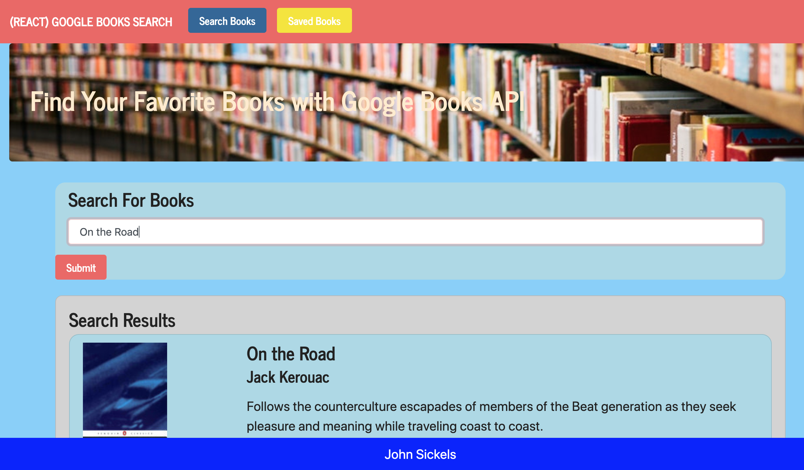

# Google Books Search

### Overview

In this activity, I will create a new React-based Google Books Search app. This assignment requires me to create React components, work with helper/util functions, and utilize React lifecycle methods to query and display books based on user searches. I will also use Node, Express and MongoDB so that users can save books to review or purchase later.

### App Design Notes

* This application is made up of 2 pages:

  * __Search__ User can search for books via the Google Books API and render them here. User has the option to "View" a book, bringing them to the book on Google Books, or "Save" a book, saving it to the Mongo database.

  * __Saved__ Renders all books saved to the Mongo database. User has an option to "View" the book, bringing them to the book on Google Books, or "Delete" a book, removing it from the Mongo database.

* This should be a SPA (Single Page Application) that uses [`react-router-dom`](https://github.com/reactjs/react-router) to navigate, hide and show your React components without changing the route within Express.

* The layout should include at least two React Components for each page `Search` and `Saved`.

* The following Express routes for your app:

* `/api/books` (get) - Should return all saved books as JSON.

* `/api/books` (post) - Will be used to save a new book to the database.

* `/api/books/:id` (delete) - Will be used to delete a book from the database by Mongo `_id`.

* `*` (get) - Will load the single HTML page in `client/build/index.html`. 

- - -

### Bonus Live Updates to Saved Books

* Use React routing and [socket.io](http://socket.io) to create a notification or a component that triggers whenever a user saves an book. Your message should include the title of the saved book.

  * Say you have multiple browsers open, each one visiting your site. If you save an book in one browser, then all of your browsers should notify you that a new book was saved.

  * [Socket.io NPM package](https://www.npmjs.com/package/socket.io)
  
 - - - 

### Technologies Used

* JavaScript
* Node
* Express
* React

### Google Books Search Links

[Google Books Search](https://book-search-sickels.herokuapp.com/)

**Thanks for Stopping by!**
